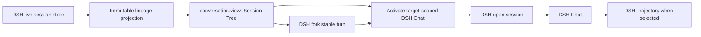

# dsh-session-tree

English | [简体中文](README.zh-CN.md)

[](https://github.com/Nirvana-Jie/dsh-session-tree/actions/workflows/ci.yml)
[](package.json)
[](LICENSE)

See every fork and subagent in your [DeepSeek Harness](https://github.com/deepseek-ai/deepseek-harness) workflow—without leaving the session you are working in.

`dsh-session-tree` is a native DSH Web plugin that turns the live session graph into an interactive lineage view. It helps developers recover context, compare parallel directions, and continue from the right branch before the wrong history turns into the next edit.

[Demo](#demo) · [Why it helps](#why-it-helps) · [Install](#install) · [Use it](#use-it) · [How it works](#how-it-works) · [Architecture](docs/architecture.md)

## Demo

Start with one real prompt, create a child from the completed session, continue with inherited context, inspect the resulting lineage, and reopen the parent—all inside DSH Web.

<p align="center"><a href="docs/assets/dsh-session-tree-demo.mp4"><strong>▶ Watch the 35-second real workflow</strong></a></p>

## Why it helps

Agent work rarely stays linear. A debugging session forks into an experiment, a subagent explores another path, and yesterday's branch becomes today's starting point. A flat session list tells you what exists; Session Tree tells you how those sessions are related.

| When you need to… | Session Tree gives you… |
| --- | --- |
| Return to a long-running task | The root, its descendants, and the currently open session in one view |
| Try a risky alternative | A one-click fork from the selected session's latest stable turn |
| Follow delegated work | Subagents distinguished from ordinary forks in the same lineage |
| Navigate a large lineage | The current path expanded by default, unrelated branches collapsed, and standard tree keyboard controls |
| Resume the correct context | Session title, ID, parent, workspace, preset, status, and recent activity before you open it |
| Inspect what happened on a branch | Open that session directly in DSH Chat, then switch to Trajectory when you need the execution ledger |
| Understand active work quickly | Live totals for sessions, branches, and running agents |

## What you get

- **Live lineage.** The view reads DSH's current session state; no export or refresh workflow is required.
- **Focused navigation.** The current ancestry opens automatically; disclosure controls, arrow keys, Home/End, and title type-ahead move through visible branches.
- **Clear duplicate titles.** Equal-titled siblings receive a compact unique ID suffix only where disambiguation is needed; complete IDs remain in the detail pane.
- **Privacy-safe workspace context.** Home-directory prefixes are displayed as `~`, so local account names do not appear in the view, screenshots, or recordings.
- **Native navigation.** Select any node and land directly in that exact session's DSH Chat view.
- **Safe branching.** Create a child from the latest stable turn through DSH's native fork operation, then continue directly in the new branch.
- **Fork and subagent semantics.** Roots, ordinary forks, and delegated subagents have distinct labels and visual markers.
- **DSH-native presentation.** Session Tree lives beside Chat and Trajectory, uses DSH controls and theme tokens, and ships English and Chinese UI text.

This is a plugin inside DSH Web, not a second session viewer. There is no standalone HTML page and no plaintext session log to export or manage.

## Install

Requirements: DeepSeek Harness, Node.js `^22.19.0 || >=24.0.0`, and pnpm.

### From GitHub

```sh
dsh plugin --profile web add github:Nirvana-Jie/dsh-session-tree
dsh web
```

Git dependencies build during installation. If pnpm asks you to allow the package's `prepare` script, add the exact key printed by DSH to the web profile's `pnpm-workspace.yaml`, then run the install command again.

### From a local checkout

```sh
git clone https://github.com/Nirvana-Jie/dsh-session-tree.git
cd dsh-session-tree
pnpm install
pnpm build
dsh plugin --profile web add .
dsh web
```

The plugin contributes its own `cordis.patch.yml`; no manual edit to the DSH repository or web profile is needed.

## Use it

1. Open or create a session in DSH Web.
2. Choose **Session Tree** beside **Chat** and **Trajectory**.
3. Expand or collapse branches and select a root, fork, or subagent to inspect its context. Keyboard users can use the arrow keys, Home/End, Enter, or a title's first character.
4. Choose **Open session** to enter that session directly in **Chat**, or choose **Fork latest stable turn** to create a branch and enter its Chat view.
5. Continue the conversation, or switch to DSH's **Trajectory** tab to inspect the selected branch's execution ledger.

The tree updates from DSH's live session store. New forks and subagents appear in the lineage as the Harness reports them.

## How it works



The package is both a DSH bundle and a browser client plugin. Its bundle layer activates the package in the `web` profile; the client registers a `conversation.view` contribution and receives the session store, scope-addressed Chat activation, navigation, fork operations, and UI primitives from DSH. The view only projects session metadata. DSH remains the owner of session persistence, mutations, and the active Chat or Trajectory view.

Read [Architecture](docs/architecture.md) for the package boundaries, lifecycle, view model, and extension rules.

## Development

```sh
pnpm install
pnpm check
```

`pnpm check` runs the public-interface Vitest coverage gate, type checking, linting, the production build, and package validation.

## License

[MIT](LICENSE)
