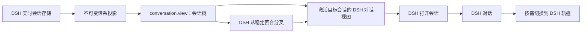

# dsh-session-tree

[English](README.md) | 简体中文

[](https://github.com/Nirvana-Jie/dsh-session-tree/actions/workflows/ci.yml)
[](package.json)
[](LICENSE)

不离开当前会话，就能看清 [DeepSeek Harness](https://github.com/deepseek-ai/deepseek-harness) 工作流里的每次分叉与每个子代理。

`dsh-session-tree` 是一个原生 DSH Web 插件，它把实时会话关系转换成交互式谱系视图，帮助开发者快速找回上下文、理解并行探索方向，并在下一次修改代码前回到正确的会话分支。

[效果演示](#效果演示) · [为什么有用](#为什么有用) · [安装](#安装) · [使用](#使用) · [工作原理](#工作原理) · [架构](docs/architecture.zh-CN.md)

## 效果演示

从一次真实输入开始，从已完成的会话创建子分支，继承上下文继续工作，查看形成的谱系，再重新打开父会话——所有操作都在 DSH Web 内完成。

https://github.com/user-attachments/assets/5e475722-7b1c-4383-9b66-7881f6799420

## 为什么有用

Agent 的工作很少始终保持线性：一次调试可能分叉出新实验，子代理会沿另一条路径探索，昨天的分支也可能成为今天的起点。扁平会话列表只能告诉你有哪些会话；Session Tree 还能告诉你它们之间的关系。

| 当你需要…… | Session Tree 会提供…… |
| --- | --- |
| 回到一个长期任务 | 在同一视图中查看根会话、全部后代和当前会话 |
| 尝试风险较高的方案 | 从所选会话的最近稳定回合一键创建分支 |
| 跟进委派任务 | 在同一谱系中区分子代理与普通 fork |
| 导航大型谱系 | 默认展开当前路径、折叠无关分支，并提供标准树键盘操作 |
| 恢复正确上下文 | 打开前先确认会话标题、ID、父会话、工作区、预设、状态和最近活动 |
| 检查某条分支发生了什么 | 直接在 DSH“对话”中打开对应会话，需要执行记录时再切换到“轨迹” |
| 快速理解当前工作 | 实时查看会话数、分支数和运行中 Agent 数量 |

## 你会得到什么

- **实时谱系。** 视图直接读取 DSH 当前会话状态，不需要导出文件或手动刷新。
- **聚焦导航。** 当前祖先路径会自动展开；可以通过折叠控件、方向键、Home/End 和标题首字母在可见分支间移动。
- **清晰区分重名会话。** 只有同级同名节点会显示紧凑的唯一 ID 后缀，完整 ID 仍保留在详情面板。
- **保护工作区隐私。** 用户主目录前缀统一显示为 `~`，本地账户名不会出现在界面、截图或录屏中。
- **原生导航。** 选择任意节点，直接进入该会话准确对应的 DSH“对话”视图。
- **安全分叉。** 通过 DSH 原生 fork 操作从最近稳定回合创建子会话，并直接进入新分支继续工作。
- **明确的关系语义。** 根会话、普通分支与委派子代理具有不同标签和视觉标记。
- **融入 DSH 的体验。** Session Tree 与“对话”“轨迹”并列，使用 DSH 控件和主题变量，并提供中英文界面。

它是 DSH Web 内部的插件，不是第二套会话查看器：无需打开独立 HTML，也无需导出或管理明文会话日志。

## 安装

环境要求：DeepSeek Harness、Node.js `^22.19.0 || >=24.0.0` 和 pnpm。

### 从 GitHub 安装

```sh
dsh plugin --profile web add github:Nirvana-Jie/dsh-session-tree
dsh web
```

Git 依赖会在安装阶段构建。如果 pnpm 提示需要允许该包的 `prepare` 脚本，请把 DSH 输出的准确键名加入 web profile 的 `pnpm-workspace.yaml`，再重新执行安装命令。

### 从本地源码安装

```sh
git clone https://github.com/Nirvana-Jie/dsh-session-tree.git
cd dsh-session-tree
pnpm install
pnpm build
dsh plugin --profile web add .
dsh web
```

插件会通过自身的 `cordis.patch.yml` 加入 web profile，不需要手动修改 DSH 仓库或 profile 配置。

## 使用

1. 在 DSH Web 中打开或创建一个会话。
2. 在“对话”“轨迹”旁选择 **会话树**。
3. 展开或折叠分支，并选择一个根会话、分支或子代理检查其上下文。键盘用户可以使用方向键、Home/End、Enter 或标题首字母。
4. 选择 **打开会话**，直接在“对话”中进入该会话；也可以选择 **从最近稳定回合创建分支**，新建分支并进入它的“对话”视图。
5. 继续对话，或切换到 DSH 的“轨迹”标签检查所选分支的执行记录。

会话树从 DSH 实时会话存储更新；Harness 上报新的 fork 或 subagent 后，对应节点会出现在谱系中。

## 工作原理



该包同时是 DSH bundle 和浏览器客户端插件。bundle 层负责在 `web` profile 中启用插件；客户端注册 `conversation.view` 扩展，并从 DSH 获取会话存储、按 scope 寻址的“对话”激活能力、导航、fork 操作和 UI primitives。视图只投影会话元数据；会话持久化、修改以及当前“对话”或“轨迹”视图仍由 DSH 负责。

如需了解包边界、生命周期、视图模型和扩展规则，请阅读[架构文档](docs/architecture.zh-CN.md)。

## 开发

```sh
pnpm install
pnpm check
```

`pnpm check` 会运行面向公共接口的 Vitest 覆盖率门禁、类型检查、lint、生产构建与包校验。

## 许可证

[MIT](LICENSE)
