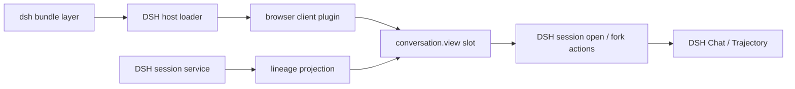

# Architecture

English | [中文](architecture.zh-CN.md)

This document defines how `dsh-session-tree` integrates with DeepSeek Harness Web and which responsibilities remain owned by DSH.

## Product boundary

The product job is to put the developer in the correct durable session context before the next prompt or code change. The tree is an interaction index for that job, not a second session product.

| Layer | Responsibility |
| --- | --- |
| DSH | Session truth, persistence, current-session navigation, stable-turn fork semantics, Chat and Trajectory views, theme tokens, and shared controls |
| Session Tree | Pure lineage projection, local selection/focus/expansion state, relationship presentation, and orchestration of DSH open/fork operations |

The plugin therefore has no router, log parser, persistence format, message cache, or independent application shell.

## Runtime position

The package declares two DSH roles in `package.json`:

- `dsh.bundle.patch` points to `cordis.patch.yml`, which activates the package in an installed profile.
- `dsh.client` declares the browser entry and the DSH client services it consumes.

The host entry has no independent application behavior. DSH discovers the client export, places its bundle in the Web boot graph, and provides React, Cordis, locale, session runtime, and conversation slots at runtime.

## View registration

`src/client/index.tsx` registers all contributions through Cordis effects:

1. English and Chinese dictionaries under the `session-tree` locale namespace.
2. Layout styles that use DSH theme tokens, stay scoped to `dst-*` classes, and compose DSH `Button`, `Pill`, `StateDot`, and icon primitives.
3. A `conversation.view` contribution named `session-tree`.

The view therefore participates in the same lifecycle as Conversation and Trace. Disposing or reloading the plugin removes its registrations; it does not create a second web application or global router.

## Live data model

`SessionTreeView` receives the current `sessionId` and `useSessions` selector from DSH's conversation view contract. `buildSessionTree()` converts the current `SessionListState` into an immutable forest:

- `parentId` attaches a session beneath its known parent.
- `origin: 'subagent'` distinguishes delegated work from an ordinary fork.
- `current` marks the session open in the conversation surface.
- `running`, `completed`, `updatedAt`, `cwd`, and `agentPreset` remain DSH-owned metadata displayed by the view.

Input order is preserved for roots and siblings so the tree follows the ordering already chosen by DSH. A session whose parent is outside the current snapshot becomes a root. Duplicate IDs and parent cycles are rejected because they cannot form an unambiguous lineage.

Non-current rows with `blank: true` are provisional New Session placeholders rather than durable contexts, so the projection excludes them from nodes and totals. A current blank session remains visible so the context on stage never disappears.

The projection groups siblings by exact `displayTitle`. Only a duplicate-titled group receives qualifiers, and each qualifier is the shortest unique session-ID suffix with a six-character readability floor. The complete opaque ID remains available in the selected-session detail pane.

DSH keeps ordinary list rows in `SessionListState.ids` and may keep the currently addressed subagent route only in `byId`. The projection appends that DSH-provided current route before building the forest, so the context currently on stage cannot disappear from the lineage merely because it was opened through a subagent catalog.

The projection never fetches or copies message bodies, tool calls, or session-log events.

## Interaction ownership

Selecting, focusing, expanding, or collapsing a node changes only component-local state. The current session's ancestor path is expanded on entry, while unrelated branches remain collapsed. The tree uses roving focus and WAI-ARIA single-select tree behavior: Left/Right collapse or traverse a level, Up/Down traverse visible nodes, Home/End reach the visible boundaries, and a typed initial finds the next matching title.

Actions cross back into DSH through injected services:

- **Open session** calls `ctx.sessions.open(sessionId)` through the documented Sessions service.
- **Fork latest stable turn** calls `ctx.sessions.fork({ sessionId, increaseTitle: true })`, then opens the returned child ID through that same Sessions service.

DSH chooses the stable fork boundary, creates and persists the child, updates the session store, owns per-session active-view state, and performs navigation. The plugin only sequences public DSH operations. It does not write session files, synthesize lineage metadata, or mutate a parent session.

Chat and Trajectory remain sibling DSH `conversation.view` entries. DSH owns each session's active-view state, and a newly created child has no prior selection, so it resolves to the stable Chat default when Session Tree opens it. The plugin does not duplicate the Trajectory ledger, invent Conversation methods, or write Conversation's private active-view store.

## Web presentation

The view fills the resident DSH conversation area and opts into the same composer-overlay layout used by Trajectory. A compact header and a flat split pane replace the previous marketing hero, metric cards, nested dashboard card, and custom square controls. The left pane is the lineage index; the right pane contains only the selected session facts and native actions.

DSH controls carry button, pill, state-dot, icon, focus, and theme behavior. The plugin-specific visual language is limited to disclosure arrows, lineage connector rails, compact duplicate-title qualifiers, and the distinction between the selected node and DSH's current session. Relationship labels and full IDs live in the detail pane instead of repeating on every row. Both panes reserve DSH's live composer height so their final rows and actions remain reachable.

The detail pane treats `cwd` as display-only metadata. macOS, Linux, and Windows user-home prefixes are collapsed to `~` before rendering so local account names do not enter the browser DOM, screenshots, or recordings. The canonical DSH-owned `cwd` is neither changed nor written back.

## Package boundary

DSH client packages, UI primitives, and React are optional peers and stay external to the browser bundle. This keeps one runtime instance owned by the host and avoids duplicating service identities or control implementations. The local declaration file describes the narrow compile-time faces used by this package; real-profile verification exercises the production bundle against the DSH-provided modules.

The production browser artifact is a Cordis client bundle (`lib/client.cjs`). The host artifact (`lib/index.js`) exists so the package can participate in the loader tree, while `cordis.patch.yml` is the installable composition layer.

## Change rules

- Add user-visible behavior through documented DSH services or slots, not direct Web application edits.
- Keep the lineage projection pure and immutable.
- Route session persistence, navigation, and fork mutations through DSH.
- Register every lifecycle contribution through `ctx.effect()` or a disposer-returning DSH registry.
- Update English and Chinese product documentation and locale text together.
- Cover changed public behavior with Vitest and verify the production client bundle against a real DSH Web profile.
