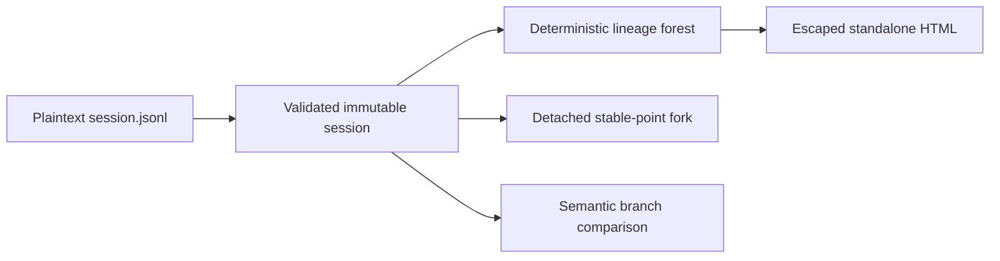

# Architecture

English | [中文](architecture.zh-CN.md)

This document defines the current data responsibilities and compatibility rules for `dsh-session-tree`.

## Data flow

Import is the only untrusted-data boundary. Tree construction, forking, comparison, and rendering consume validated immutable values and return new values without changing an imported session.

## Immutable model

`ImportedSession` contains one v0 header and a frozen event array. Every nested JSON object and array in event data is frozen. Public operations do not retain mutable parser objects and do not expose a parent event by reference from a newly created fork.

The importer requires a supported header, non-negative safe-integer metadata, contiguous event sequences, safe-integer timestamps, and valid packed storage rows. It expands `text-chunks`, `reasoning-chunks`, and `tool-call-chunks` into their physical events without joining token-sized members. Unsupported versions fail before lineage operations.

## Lineage

`getTree()` indexes sessions by opaque ID, rejects duplicates, walks every known parent chain to reject cycles, and then attaches known children. A missing parent is not fabricated; its child becomes a root in the returned forest. Roots and siblings sort by creation time and then ID, so input order cannot change the result.

## Forking

`forkAt()` treats its sequence argument as an inclusive boundary. The boundary must exist, event sequences must already be valid, and the selected prefix must close every core turn it opens. The operation copies the prefix, adds child header metadata, appends `session/end-seed` when needed, serializes the detached artifact, and imports it again to apply the same validation and deep-freeze rules.

The child records `parentSession` as the source ID and `seedLength` as the number of inherited events before the marker. `cwd` and `agentPreset` are inherited when present. Runtime-specific continuation and persistence remain outside this package.

## Comparison

`compareBranches()` removes `session/end-seed` from each comparison view, then finds the exact common prefix of complete events. Timestamps, sequence numbers, event types, and data all participate. The result identifies the last common source sequence and returns frozen side-specific suffixes.

This operation explains divergence; it does not decide which branch is better. Outcome scoring belongs in an evaluation layer such as `dsh-eval-lab`.

## Presentation and security

`renderTreeHtml()` receives only the projected lineage tree, never full session events. It escapes the title, IDs, timestamps, and seed metadata and embeds no script or remote asset. The CLI writes the result with mode `0600`.

The source artifacts remain sensitive. Import validation provides format safety, not redaction or trust in event contents.

## Extension rules

New persisted versions require an explicit parser and compatibility decision. New lifecycle-aware fork points must be proven against the owning event semantics. A future Harness plugin should adapt this immutable model to runtime persistence rather than adding hidden mutation here.
