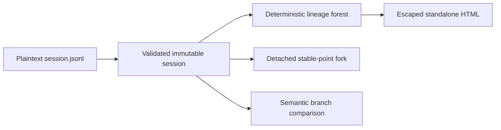

# 架构

[English](architecture.md) | 中文

本文定义 `dsh-session-tree` 当前的数据职责和兼容性规则。

## 数据流

导入是唯一的不可信数据边界。树构建、分叉、比较和渲染只接收已校验的不可变值，并返回新值，不修改导入会话。

## 不可变模型

`ImportedSession` 包含一个 v0 头部和冻结的事件数组。事件数据中每个嵌套 JSON 对象和数组都会被冻结。公共操作不保留可变解析器对象，新建分叉也不会通过引用暴露父会话事件。

导入器要求头部版本受支持，元数据是非负安全整数，事件序号连续，时间戳是安全整数，压缩存储行格式有效。它将 `text-chunks`、`reasoning-chunks` 和 `tool-call-chunks` 展开为物理事件，但不合并 token 粒度的成员。不支持的版本在谱系操作前直接失败。

## 谱系

`getTree()` 按不透明 ID 索引会话，拒绝重复项，遍历每条已知父链以拒绝环路，再挂接已知子节点。父会话缺失时不会创建虚构节点；对应子会话成为返回森林的根节点。根节点和同级节点先按创建时间、再按 ID 排序，因此输入顺序不会改变结果。

## 分叉

`forkAt()` 把序号参数视为包含端点的边界。边界必须存在，导入阶段已经保证事件序号有效，所选前缀还必须闭合它开启的每个核心 turn。该操作复制前缀，添加子会话头部元数据，按需追加 `session/end-seed`，序列化独立产物，再次导入以应用同一套校验和深度冻结规则。

子会话把源 ID 记录为 `parentSession`，把标记前继承的事件数量记录为 `seedLength`。存在 `cwd` 和 `agentPreset` 时会继承它们。运行时续跑和持久化不属于本包当前职责。

## 比较

`compareBranches()` 从两侧的比较视图中移除 `session/end-seed`，再查找完整事件严格相同的最长公共前缀。时间戳、序号、事件类型和数据都参与比较。结果标出最后一个公共源序号，并返回冻结的两侧专属后缀。

该操作解释分歧，但不判断哪个分支更好。结果评分应由 `dsh-eval-lab` 等评测层负责。

## 展示与安全

`renderTreeHtml()` 只接收投影后的谱系树，不接收完整会话事件。它转义标题、ID、时间戳和种子元数据，不嵌入脚本或远程资源。CLI 以 `0600` 权限写入结果。

源产物仍属于敏感数据。导入校验只提供格式安全，不负责脱敏，也不信任事件内容。

## 扩展规则

新增持久化版本时必须实现显式解析器并作出兼容性决定。新增理解生命周期的分叉点时，必须针对对应事件语义证明其有效性。未来的 Harness 插件应把这个不可变模型适配到运行时持久化层，而不是在本包内部增加隐藏修改。
