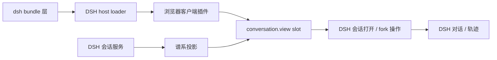

# 架构

[English](architecture.md) | 中文

本文定义 `dsh-session-tree` 如何接入 DeepSeek Harness Web，以及哪些职责继续由 DSH 负责。

## 产品边界

产品的根本任务，是在下一次提示或代码修改前，让开发者进入正确、持久的会话上下文。会话树只是完成这一任务的交互索引，不是第二套会话产品。

| 层级 | 职责 |
| --- | --- |
| DSH | 会话事实、持久化、当前会话导航、稳定回合的 fork 语义、“对话”和“轨迹”视图、主题变量与共享控件 |
| Session Tree | 纯谱系投影、本地选中/焦点/展开状态、关系展示，以及 DSH open/fork 操作的编排 |

因此，该插件不包含自己的路由、日志解析器、持久化格式、消息缓存或独立应用外壳。

## 运行时位置

该包在 `package.json` 中声明两种 DSH 角色：

- `dsh.bundle.patch` 指向 `cordis.patch.yml`，负责在已安装的 profile 中启用该包。
- `dsh.client` 声明浏览器入口及其消费的 DSH 客户端服务。

host 入口没有独立应用行为。DSH 会发现客户端 export，把对应 bundle 加入 Web 启动图，并在运行时提供 React、Cordis、locale、会话 runtime 和 conversation slot。

## 视图注册

`src/client/index.tsx` 通过 Cordis effect 注册全部贡献：

1. `session-tree` locale namespace 下的中英文词典。
2. 使用 DSH 主题变量、限定在 `dst-*` class 内的布局样式，并组合 DSH 的 `Button`、`Pill`、`StateDot` 与图标 primitives。
3. 名为 `session-tree` 的 `conversation.view` 贡献。

因此，该视图与“对话”“轨迹”具有相同生命周期。插件被释放或重新加载时，它的注册也会移除；它不会创建第二套 Web 应用或全局路由。

## 实时数据模型

`SessionTreeView` 通过 DSH conversation view contract 接收当前 `sessionId` 和 `useSessions` selector。`buildSessionTree()` 把当前 `SessionListState` 转换成不可变森林：

- `parentId` 把会话挂到已知父会话之下。
- `origin: 'subagent'` 用于区分委派工作和普通 fork。
- `current` 标记 conversation surface 当前打开的会话。
- `running`、`completed`、`updatedAt`、`cwd` 与 `agentPreset` 仍是由 DSH 提供、由该视图展示的元数据。

根节点和同级节点保留输入顺序，使会话树遵循 DSH 已经确定的排列。父会话不在当前快照时，对应会话会成为根节点。重复 ID 和父链环路无法构成明确谱系，因此会被拒绝。

带有 `blank: true` 的非当前行是临时“新会话”占位符，不是持久化上下文，因此不会进入节点和统计。当前空白会话仍然可见，确保台上的上下文不会消失。

投影按照完全相同的 `displayTitle` 对同级节点分组。只有同名组会得到消歧标识；每个标识都是会话 ID 的最短唯一后缀，并以六个字符作为可读性下限。完整的不透明 ID 仍显示在所选会话详情面板中。

DSH 把常规列表行放在 `SessionListState.ids` 中，但当前通过地址打开的 subagent 路径可能只存在于 `byId`。投影会先追加这条由 DSH 提供的当前路径，再构建森林，因此当前台上的上下文不会仅因为它来自 subagent catalog 而从谱系中消失。

投影过程不会读取或复制消息正文、工具调用或 session log 事件。

## 交互职责

选择、聚焦、展开或折叠节点只会修改组件本地状态。进入视图时默认展开当前会话的祖先路径，无关分支保持折叠。树使用游标焦点和 WAI-ARIA 单选树行为：左/右方向键折叠或跨层级移动，上/下方向键遍历可见节点，Home/End 到达可见首尾，输入标题首字母跳转到下一个匹配节点。

操作通过注入服务回到 DSH：

- **打开会话** 通过已记录的 Sessions 服务调用 `ctx.sessions.open(sessionId)`。
- **从最近稳定回合创建分支** 调用 `ctx.sessions.fork({ sessionId, increaseTitle: true })`，再通过同一个 Sessions 服务打开返回的子会话 ID。

稳定分叉边界的选择、子会话创建与持久化、会话存储更新、逐会话活跃视图状态以及导航均由 DSH 负责。插件只编排 DSH 的公共操作，不会写入会话文件、伪造谱系元数据或修改父会话。

“对话”与“轨迹”仍是 DSH 中并列的 `conversation.view` 条目。每个会话的活跃视图状态由 DSH 持有；新创建的子会话没有历史选择，因此 Session Tree 打开它时会落到稳定的默认“对话”视图。插件不会复制 Trajectory ledger、虚构 Conversation 方法，也不会写入 Conversation 私有的 active-view store。

## Web 展示

该视图填满 DSH 常驻 conversation 区域，并采用与“轨迹”相同的 composer overlay 布局。紧凑标题栏和平面双栏布局取代了之前的营销型 hero、指标卡片、嵌套 dashboard 卡片与自定义方形控件。左栏是谱系索引，右栏只保留所选会话事实和原生操作。

按钮、pill、状态点、图标、焦点与主题行为由 DSH 控件负责。插件独有的视觉语言只保留折叠箭头、谱系连接线、同名会话短标识，以及“所选节点”和“DSH 当前会话”的区别。关系标签和完整 ID 只在详情面板中出现，不再重复占用每一行。两栏都会为 DSH 实时 composer 高度预留空间，确保最后一行和操作按钮仍可访问。

详情面板只把 `cwd` 作为展示元数据使用。渲染前会将 macOS、Linux 和 Windows 的用户主目录前缀折叠为 `~`，使本地账户名不会进入浏览器 DOM、截图或录屏。DSH 持有的规范 `cwd` 不会被修改或写回。

## 包边界

DSH 客户端包、UI primitives 和 React 都是 optional peer，并在浏览器 bundle 中保持 external。这样可以由 host 维护唯一运行时实例，避免复制服务 identity 或控件实现。仓库内的 declaration 文件只描述本包使用的窄编译接口；真实 profile 验证会让生产 bundle 直接使用 DSH 提供的模块。

生产浏览器产物是 Cordis client bundle（`lib/client.cjs`）。host 产物（`lib/index.js`）让该包能够参与 loader tree，`cordis.patch.yml` 则是可安装的组合层。

## 变更规则

- 用户可见行为通过 DSH 已记录的服务或 slot 扩展，不直接修改 Web 应用。
- 谱系投影保持纯函数和不可变。
- 会话持久化、导航与 fork 修改交由 DSH。
- 每项生命周期贡献都通过 `ctx.effect()` 或返回 disposer 的 DSH registry 注册。
- 产品文档和 locale 文本的中英文版本同步更新。
- 变更后的公共行为使用 Vitest 覆盖，并在真实 DSH Web profile 中验证生产客户端 bundle。
